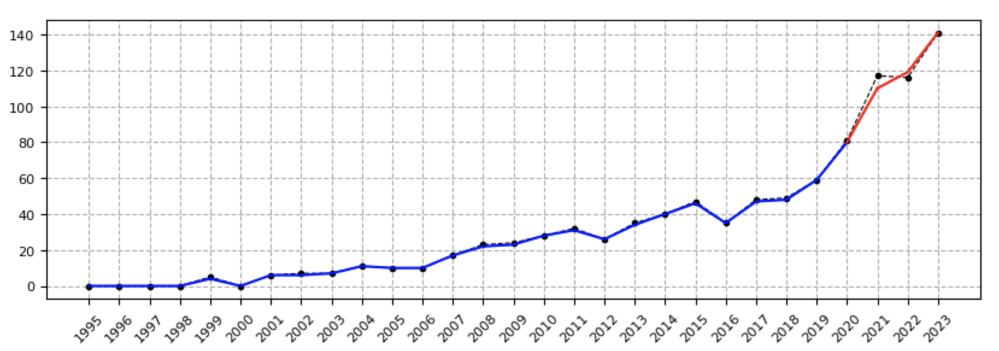

# Portfolio

## Machine Learning

### First Names: time series

I constructed a time series model to predict name choice in Belgium, based on historical data.

 

 

---
### Sudoku Solver

I created a Sudoku Solver in Python, and made a website to make it publicly available.

 

 

---
